# Portfolio Explorer

An interactive website for exploring **Markowitz minimum-variance portfolios** with three real assets (the **S&P 500**, **gold** and **Solana**), built to accompany an IB Mathematics: Analysis & Approaches HL Internal Assessment.

> **Research question:** How does the minimum-risk allocation between the S&P 500, gold and Solana change as the target monthly return increases, and for which target returns can it be achieved without short-selling?

Each page follows the same pattern: **question → your guess → intuition → the maths (one step at a time, with “why this step?”) → experiment → finding → check**. A backend API pulls real market data with full provenance, and a bundled snapshot reproduces the IA's numbers exactly.

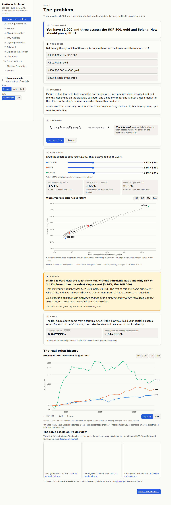

## Contents

- [Quick start](#quick-start)
- [Getting a free FRED API key](#getting-a-free-fred-api-key)
- [Deploying to Vercel](#deploying-to-vercel)
- [The pages](#the-pages)
- [The API](#the-api)
- [Data sources](#data-sources)
- [The maths engine](#the-maths-engine)
- [Tests](#tests)
- [Project structure](#project-structure)
- [Screenshots](#screenshots)

## Quick start

You need **Node.js 20 or newer** ([download](https://nodejs.org/)).

```bash
git clone <this repository>
cd Math-Behind-Stocks
npm install
cp .env.example .env.local     # then paste your FRED key into .env.local (optional)
npm run dev                    # open http://localhost:3000
```

The site works **without any API key**: it uses the bundled IA snapshot (`data/snapshot.json`) by default. Switch the sidebar's **Data** control to **Live** to use live sources. If a source is unavailable, a banner says so and the snapshot fills in for that asset.

Other commands:

| Command | What it does |
|---|---|
| `npm test` | Run all unit, property and API tests (no network needed) |
| `npm run typecheck` | TypeScript type check |
| `npm run build && npm start` | Production build and server |
| `node scripts/screenshots.mjs http://localhost:3000 docs/screenshots` | Visit every page, report console errors, save full-page screenshots (`MOBILE=1`, `THEMES=light,dark` for more) |
| `node scripts/a11y.mjs http://localhost:3000` | Accessibility audit (axe-core, WCAG 2 A/AA) of every page in light, dark and phone width |

The two scripts need a Chromium browser for Playwright: run `npx playwright install chromium` once, or set `CHROMIUM_PATH` to an existing Chromium.

## Getting a free FRED API key

The S&P 500 comes from FRED (Federal Reserve Bank of St. Louis), which needs a free key:

1. Create a free account at <https://fredaccount.stlouisfed.org/login/secure/>.
2. Go to **My Account → API Keys** (<https://fredaccount.stlouisfed.org/apikeys>) and click **Request API Key**. Describe the use, e.g. “School maths project”.
3. Copy the 32-character key into `.env.local`:
   ```
   FRED_API_KEY=abcdef0123456789abcdef0123456789
   ```
4. Restart `npm run dev`.

The key is only read on the server (in `lib/data/providers/fred.ts`). It is never sent to the browser, and it is redacted (`api_key=REDACTED`) in every provenance URL.

## Deploying to Vercel

1. Push this repository to GitHub.
2. At <https://vercel.com/new>, import the repository. Vercel detects Next.js automatically; no build settings need changing.
3. Under **Settings → Environment Variables**, add `FRED_API_KEY` (all environments).
4. Deploy.

On Vercel the file cache lives in `/tmp`, which can be wiped between requests. When that happens the API simply fetches again (still at most once a day per warm instance). If a source is down and nothing is cached, it falls back to the snapshot and says so. Set `CACHE_DIR` to change where the cache is stored.

## The pages

| # | Page | The question it asks |
|---|---|---|
| 1 | The problem (`/`) | You have $1,000 and three assets. How should you split it? |
| 2 | Data & provenance (`/data`) | Will two people get the same number for “the March price”? (average vs month-end, date alignment) |
| 3 | Returns (`/returns`) | Did a Solana holder really earn the average return? (AM vs GM, volatility drag simulator) |
| 4 | Risk & correlation (`/risk`) | Why can mixing risky assets be *less* risky? (draw-your-own regression line, six-term variance bars) |
| 5 | Why matrices (`/matrices`) | How many terms for 500 assets? (wᵀΣw expanded, n(n+1)/2 counter) |
| 6 | Lagrange: the idea (`/lagrange`) | Where is the lowest-risk point on the target line? (contour ellipses, tangency, ∇f ∥ ∇g, find-the-minimum game) |
| 7 | Solving it (`/solving`) | Exactly how should $1,000 be split for 2%/month? (step-by-step Gauss–Jordan, A, B, C, D, λ₁, λ₂) |
| 8 | Exploring the solution (`/explore`) | Six investigations: linear weights; when short-selling starts; the frontier's shape; the Solana short; a what-if lab; AM vs GM |
| 9 | Limitations (`/limitations`) | How far can we trust the answer? (bootstrap, rolling windows, long-only/KKT frontier, downside deviation) |
| 10 | For my write-up (`/write-up`) | Key numbers (CSV), key equations (copy LaTeX), key charts |

Also: a **glossary and notation table** (`/glossary`) and readable **API docs** (`/api-docs`).

Site-wide features:
- **Classmate mode** (sidebar) swaps symbols for words in every derivation.
- **Light and dark themes** (follows your system setting by default).
- **Exports:** every chart has **PNG**, **SVG** and **CSV** buttons, and every equation has **Copy LaTeX**. Exports carry a caption with the data source and date range.
- **Accessibility:** keyboard-operable sliders and drag handles, a table view for every chart, text alternatives for charts, and zero axe violations on every page (light, dark and phone width).

## The API

The OpenAPI 3.1 spec is served at **`/api/docs`**. Every response includes a `provenance` block with the source name, URL, retrieval timestamp, resampling method, observations used per month, cache status, and whether any fallback was used.

Common query parameters: `assets` (default `SPX,XAU,SOL`), `from`/`to` (`YYYY-MM`), `method` (`average` | `close`), `source` (`live` | `snapshot`), `solInterval` (`weekly` | `daily`).

| Endpoint | Returns |
|---|---|
| `GET /api/prices` | Monthly prices |
| `GET /api/returns` | Monthly simple returns R = Pₜ/Pₜ₋₁ − 1 |
| `GET /api/stats` | Means, sample variances and SDs (n − 1), covariance and correlation matrices, geometric means, annualised figures |
| `POST /api/optimize` | Body `{ assets, from, to, method, source, targetReturn, amount, includeSteps }` → Σ, Σ⁻¹, det Σ, A, B, C, D, λ₁, λ₂, weights, dollars, variance, volatility and **checks** (weights sum to 1, target hit, wᵀΣw = frontier formula). `includeSteps: true` adds every Gauss–Jordan row operation |
| `GET /api/frontier` | `from_mu`, `to_mu`, `step` → frontier points with weights, minimum-variance portfolio, asymptotes, g and h, zero-crossings, no-short-selling interval |
| `GET /api/explore/sensitivity` | `pair=SPX,XAU&rho=-0.5,0,0.5` → minimum-variance portfolio for each replaced correlation. Each Σ is checked for positive definiteness (Cholesky); impossible values return a clear error and the allowed range |
| `GET /api/snapshot` | The bundled IA dataset (works offline) |
| `GET /api/docs` | OpenAPI spec |

Examples:

```bash
curl "localhost:3000/api/stats?source=snapshot"
curl -X POST localhost:3000/api/optimize -H 'content-type: application/json' \
     -d '{"source":"snapshot","targetReturn":0.02,"amount":1000}'
curl "localhost:3000/api/frontier?source=snapshot&from_mu=0.01&to_mu=0.034&step=0.001"
```

Robustness: upstream requests time out after 15 s and are retried with exponential backoff (0.5 s, 1 s, 2 s) on network errors, HTTP 429 (honouring `Retry-After`) and 5xx. Each source is cached on disk and refreshed at most once a day. If a refresh fails, the last cached copy is served with a warning; if nothing is cached, the snapshot is used with a warning. The API itself is rate-limited to 120 requests per minute per visitor.

## Data sources

| Asset | Source | Notes |
|---|---|---|
| S&P 500 | [FRED series `SP500`](https://fred.stlouisfed.org/series/SP500) (free key) | Daily closes; holidays (`.`) skipped |
| Gold | World Bank Commodity Markets “Pink Sheet”, via the [datasets/gold-prices](https://github.com/datasets/gold-prices) monthly CSV mirror | Already a monthly average (US$/troy oz), so `method=close` is not available for gold (the API says so) |
| Solana | [Kraken public OHLC API](https://docs.kraken.com/api/docs/rest-api/get-ohlc-data), pair `SOLUSD` | Weekly candles by default. Kraken only returns the latest 720 candles, so daily data reaches back only ~2 years |

**Resampling.** Everything is aligned on calendar months (UTC). `average` = mean of all observations dated in the month; `close` = last observation in the month. The unfinished current month is dropped. Each asset is summarised over its *own* observations, so Solana's weekend trading and the S&P 500's holidays don't need matching day by day.

**How weekly candles are dated.** Kraken's weekly candles run Thursday to Wednesday (UTC). Each one is dated by its **last day** (the Wednesday its close is recorded). This rule reproduces the IA exactly: for every one of the 37 months, the snapshot's Solana average × the number of Wednesdays is a whole number of cents, and no other weekday works (see the check on `/data` and in `tests/data.test.ts`).

**TradingView.** TradingView has no public data API and scraping it breaks its terms, so it is **not** used for data. Its free mini-chart widgets appear on the home page for context only.

**The snapshot.** `data/snapshot.json` holds the exact monthly averages used in the IA (Aug 2023 to Aug 2026, 37 months, 36 returns); `data/snapshot.meta.json` describes their sources.

## The maths engine

`lib/math/` is plain TypeScript with no UI code and no maths libraries. The same functions run in the browser (so sliders respond instantly) and in the API. Every function has a comment stating its formula.

| File | Contents |
|---|---|
| `stats.ts` | `simpleReturns`, `mean`, `sampleVariance`, `sampleCovariance`, `covarianceMatrix`, `correlationMatrix`, `geometricMean`, annualisation, regression, autocorrelation, downside deviation |
| `matrix.ts` | `multiply`, `transpose`, `determinant` (cofactor expansion), `inverse` (Gauss–Jordan with partial pivoting, optionally recording every row operation), `cholesky`, `isPositiveDefinite` |
| `markowitz.ts` | `lagrangeConstants` (A, B, C, D), `optimalWeights` (λ₁, λ₂, w), `linearWeightForm` (g, h), `zeroCrossings` + no-short-selling interval, `frontierVariance`, `minimumVariancePortfolio`, `asymptotes`, `checkPortfolio` |
| `sensitivity.ts` | `withCorrelation`, feasible correlation range, `betaOnOthers` (why an asset is shorted: sign of 1 − β) |
| `plane.ts` | The 2D (w₁, w₂) picture: variance, gradients, the constraint line |
| `search.ts` | Brute-force and golden-section checks, long-only optimum (w ≥ 0), bootstrap |
| `analysis.ts` | Glue from prices to all statistics, seeded simulations |

## Tests

`npm test` runs 73 tests (Vitest + fast-check), including:

- **The snapshot reproduces the IA**, each value to the significant figures shown in the IA: means, SDs, correlations, A, B, C, D, the minimum-variance portfolio, the 2% portfolio (weights, σ, λ₁, λ₂), g and h, the no-short interval [0.019439, 0.028941], the slope √(D/A) = 0.25841, the geometric means, and the S&P–gold sensitivity (0.017091, 0.024780, 0.029772).
- **Property tests** on hundreds of random positive-definite matrices: ΣΣ⁻¹ ≈ I; Gauss–Jordan = adjugate/determinant; weights sum to 1 and hit the target for any μ*; wᵀΣw = frontier formula; Σg = 1, Σh = 0; the optimum is never beaten by a feasible perturbation; ∇f = λ₂∇g at the optimum; sign of the minimum-variance weight = sign of 1 − β.
- **Data layer:** resampling, month alignment, Kraken dating rule, retries/backoff/Retry-After, daily cache with stale fallback.
- **API routes** called directly, with fake upstream sources (no network): provenance on every response, API key redaction, cache hits, snapshot fallback, positive-definite guard, validation errors, OpenAPI document.

## Project structure

```
app/                 pages (one folder per page) and API routes (app/api/*)
components/
  pattern/           the 7-part page pattern, KaTeX rendering, classmate mode
  charts/            SVG charts on a shared Plot base; Figure = export + table view + caption
  explore/           the six investigations on page 8
  layout/, ui/       navigation shell, sliders, TradingView widget
lib/
  math/              the maths engine (no UI code)
  data/              providers (FRED, gold, Kraken), resampling, calendar, cache, retries, snapshot
  api/               query parsing, rate limit, endpoint logic, OpenAPI spec
data/                snapshot.json (the IA data) + metadata
tests/               Vitest tests
scripts/             screenshot and accessibility scripts
docs/screenshots/    a full-page screenshot of every page
```

## Screenshots

| | |
|---|---|
|  Home | 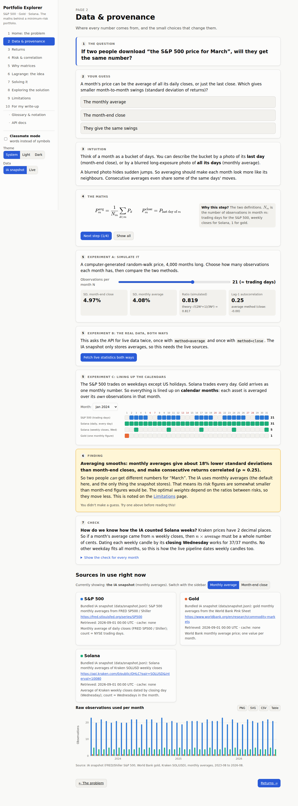 Data & provenance |
| 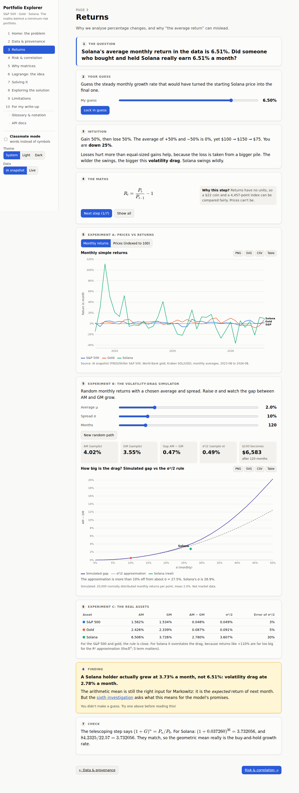 Returns | 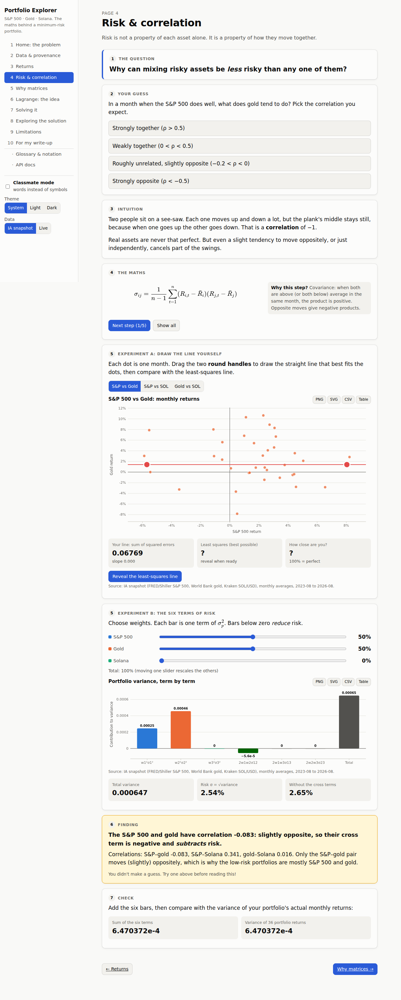 Risk & correlation |
| 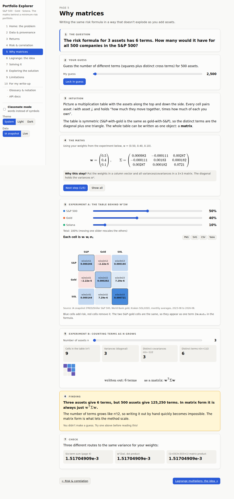 Why matrices | 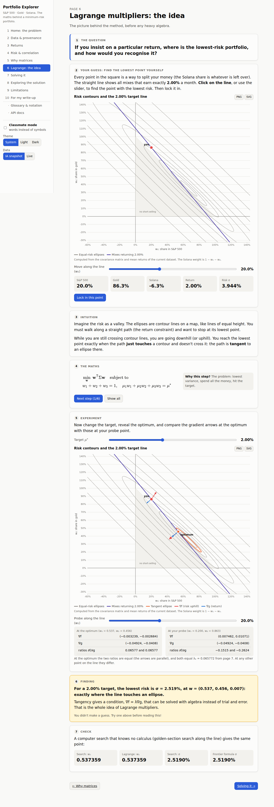 Lagrange |
| 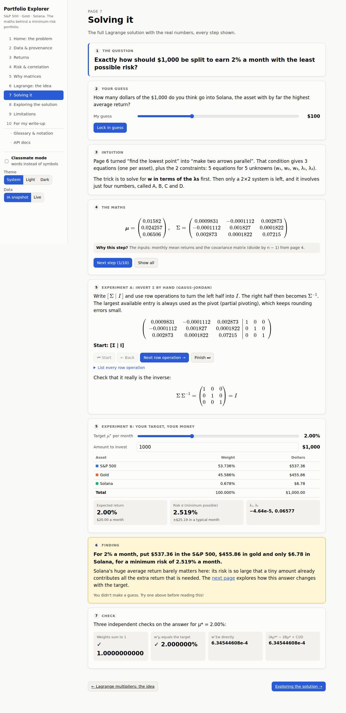 Solving it |  Exploring the solution |
| 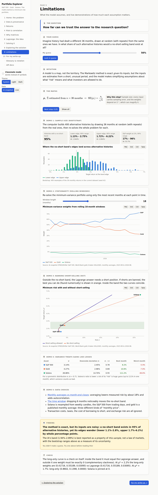 Limitations | 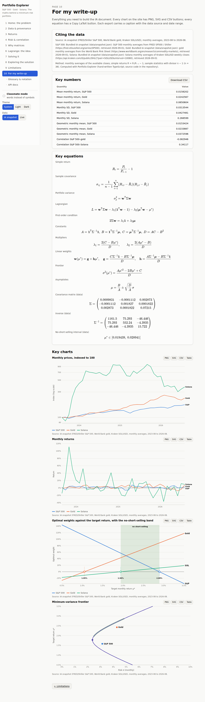 For my write-up |
| 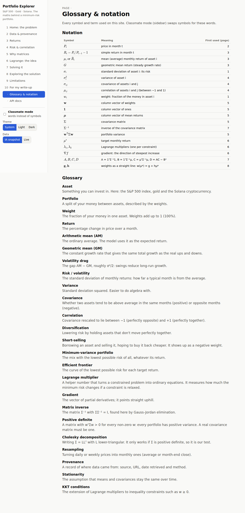 Glossary | 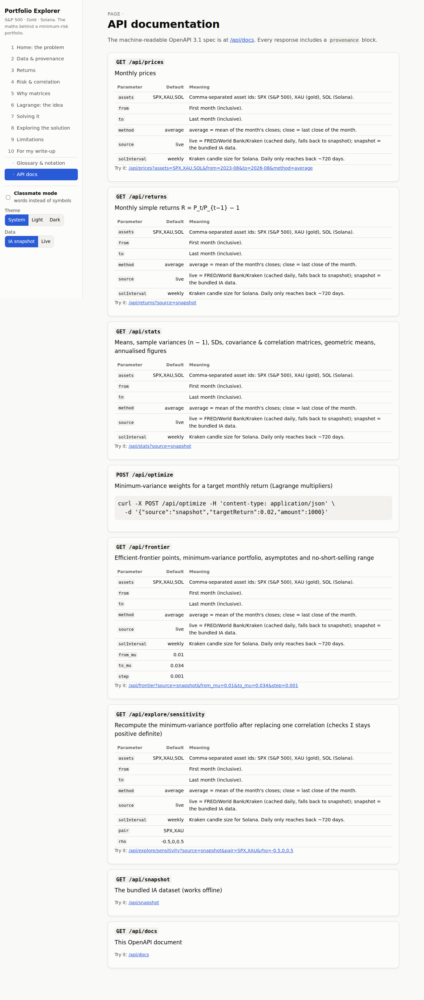 API docs |
